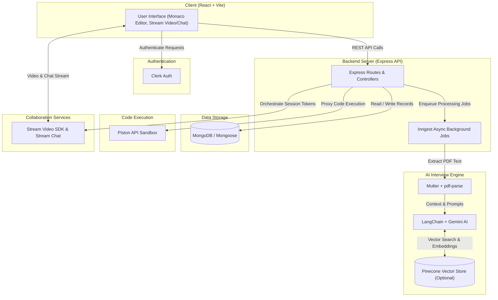

# CodeArena

> Real-Time Coding Interview & Practice Platform

[](https://react.dev/)
[](https://nodejs.org/)
[](https://www.mongodb.com/)
[](https://clerk.com/)
[](https://getstream.io/)
[](https://www.langchain.com/)
[](https://code-arena-sable.vercel.app)

---

## Overview

CodeArena is a full-stack real-time coding interview and practice platform. It combines a LeetCode-style problem judge system with live pair-interview collaboration featuring video, chat, and shared code editor capabilities. The platform also offers personalized AI-driven mock interviews powered by resume parsing and vector search.

---

## Architecture Diagram



---

## How It Works

### 1. Run/Submit Code Flow
1. **Code Execution Request**: The client sends code snippets and targeted runtime settings to `POST /api/execute`. The backend proxies this code to the sandboxed Piston API and returns raw execution logs back to the Monaco Editor workspace.
2. **Problem Submission**: When the candidate clicks submit, the client calls `POST /api/submit`.
3. **Backend Test Suite Validation**: The Express backend fetches all hidden test cases from MongoDB and executes them sequentially via Piston API.
4. **Verdict Generation**: The server compares outputs against expected test results and returns an evaluated verdict (`Accepted`, `Wrong Answer`, or `Error`).

### 2. Live Pair-Interview Session Flow (Video + Chat + Editor)
1. **Session Setup & Authentication**: Both interviewer and candidate sign in via Clerk authentication and join a shared interview room at `/api/sessions`.
2. **Media & Chat Connection**: The Express backend uses Stream Node SDK and `stream-chat` to issue secure tokens for video calls and chat channels, rendered via Stream React SDKs.
3. **Collaborative Code Editing**: Code edits are input through Monaco Editor, allowing shared real-time interaction <!-- TODO: confirm real-time sync mechanism (WebSocket / Stream / other) -->.
4. **Interactive Output**: Execution runs can be triggered live during the session, allowing both participants to review stdout, stderr, and test case outcomes simultaneously.

### 3. AI Mock Interview Flow (Resume → Parsing → Embedding → Question Generation)
1. **Resume Upload**: The candidate uploads a resume PDF (max 5MB) via a Clerk-authenticated endpoint `/api/resumes`.
2. **Text Parsing**: `Multer` handles file upload, and `pdf-parse` extracts candidate experience details, technical skills, and employment history.
3. **Context Indexing & Embedding**: LangChain processes extracted text into chunks, generating vector embeddings stored in Pinecone (if configured).
4. **Question Generation**: Google Generative AI (Gemini) queries candidate context to generate tailored technical interview questions via `/api/interviews`.

---

## Tech Stack Tables

### Frontend
| Library | Purpose |
| :--- | :--- |
| **React** | Provides component-based UI rendering and virtual DOM state management |
| **Vite** | Delivers fast module bundling and instant hot module replacement during development |
| **React Router** | Manages client-side page routing and dynamic session URL parameters |
| **Monaco Editor** | Offers a VS Code-like coding environment with syntax highlighting |
| **TanStack Query** | Handles server state management, caching, and automatic query re-fetching |
| **Tailwind CSS + DaisyUI** | Enables utility-first design and pre-styled UI component primitives |
| **Stream Video React SDK** | Powers embedded real-time audio and video conferencing in interview sessions |
| **Stream Chat React** | Provides in-session text messaging and channel-based chat UI |
| **Axios** | Executes HTTP API requests with interceptors for auth headers |
| **React Hot Toast** | Displays toast notifications for asynchronous actions and system alerts |
| **React Resizable Panels** | Allows dynamic split-pane resizing between code editor, problem prompt, and logs |
| **date-fns** | Formats date timestamps for interview schedules and session logs |
| **Lucide React** | Provides modern UI icons across navigation and control panels |
| **Canvas Confetti** | Fires visual celebration animations upon successful submission verdicts |

### Backend
| Library | Purpose |
| :--- | :--- |
| **Node.js** | Serves as the cross-platform JavaScript runtime environment for backend services |
| **Express** | Provides lightweight REST API routing, controller handling, and middleware composition |
| **MongoDB** | Offers document database storage for users, problem sets, and interview records |
| **Mongoose** | Defines Object Data Modeling (ODM) schemas and query validation for MongoDB |
| **Clerk (Express)** | Enforces session verification and token authentication on protected routes |
| **Stream Node SDK** | Generates server-side access tokens and channel permissions for live video |
| **stream-chat** | Manages server-side creation and administration of chat channels |
| **Inngest** | Manages durable async background job queues and event-driven workflows |
| **Multer** | Handles multi-part file uploads for resume PDF ingestion |
| **pdf-parse** | Extracts plain text from raw PDF buffer uploads |
| **Piston API** | Proxies and isolates untrusted user code execution in a secure sandbox |

### AI & Data
| Library | Purpose |
| :--- | :--- |
| **LangChain** | Chains document loaders, text splitters, and LLM prompt templates into workflow pipelines |
| **Google Generative AI (Gemini)** | Generates dynamic interview questions and analyzes technical responses |
| **Pinecone** | Provides vector storage and high-speed similarity search over resume context |

### Infrastructure
| Service / Tool | Purpose |
| :--- | :--- |
| **Vercel / Node Host** | Hosts static client assets and serves serverless/Node.js API endpoints |
| **Inngest Engine** | Coordinates background event routing and retries without blocking HTTP handlers |
| **Piston Sandbox API** | Executes code safely in multi-language container environments |

---

## API Reference Table

| Method | Endpoint | Auth Required | Description |
| :--- | :--- | :---: | :--- |
| `POST` | `/api/execute` | No | Executes arbitrary code snippets via Piston sandbox and returns raw output |
| `POST` | `/api/submit` | No | Evaluates code against hidden problem test cases and returns final verdict |
| `GET` | `/api/problems` | No | Fetches a list of all practice problems |
| `GET` | `/api/problems/:id` | No | Retrieves detailed problem specifications and input/output test cases |
| `POST / GET` | `/api/chat` | Yes | Provision stream-chat tokens and channel configurations for authenticated users |
| `POST / GET` | `/api/sessions` | Yes | Creates, retrieves, and updates real-time pair-interview session metadata |
| `POST / GET` | `/api/resumes` | Yes | Receives PDF resume uploads and triggers parsing background workers |
| `POST / GET` | `/api/interviews` | Yes | Interacts with the AI engine to request dynamic technical interview questions |

---

## Project Structure

```
backend/                # Express API server, database models, and background execution services
  scripts/              # Seed scripts for coding problems and initial dataset population
  src/                  # Application source code
    controllers/        # Request controllers for problems, sessions, resumes, and code execution
    lib/                # Client configurations for Stream, Pinecone, Gemini, and Inngest
    middleware/         # Express auth and validation middleware (e.g., Clerk middleware)
    models/             # Mongoose database models for Problem, Session, Resume, and Interview
    routes/             # API endpoint declarations and route handlers
    server.js           # Main Express application initialization and server listener
frontend/               # React + Vite single-page frontend application
  public/               # Static web assets, branding images, and favicon files
  src/                  # Frontend component and page implementation
    api/                # Axios HTTP client configuration and endpoint call wrappers
    components/         # Modular UI components (Monaco wrappers, video overlays, split panels)
    data/               # Mock data definitions, default templates, and seed configurations
    hooks/              # Custom React hooks for authentication, queries, and stream sessions
    lib/                # Utility modules, query client setup, and helper functions
    pages/              # Main route views (Dashboard, Interview Room, Problem List, Practice Area)
```

---

## Getting Started

### Prerequisites
- **Node.js**: `v18.0.0` or higher
- **Database**: Active MongoDB cluster URI
- **Third-Party Services**: Clerk account, Stream Video/Chat app keys, Inngest account

### Backend Environment Variables
Create `.env` inside the `backend/` directory:

| Variable | Description | Required |
| :--- | :--- | :---: |
| `PORT` | Local Express server port (default: `3000`) | Yes |
| `NODE_ENV` | Environment mode (`development` / `production`) | Yes |
| `DB_URL` | MongoDB connection string | Yes |
| `INNGEST_EVENT_KEY` | Event key for Inngest background event dispatching | Yes |
| `INNGEST_SIGNING_KEY` | Signing key for verifying Inngest Webhook signatures | Yes |
| `STREAM_API_KEY` | Stream API key for video and chat orchestration | Yes |
| `STREAM_API_SECRET` | Stream API secret for server-side token generation | Yes |
| `CLERK_PUBLISHABLE_KEY` | Clerk public key for auth middleware validation | Yes |
| `CLERK_SECRET_KEY` | Clerk secret key for server API interactions | Yes |
| `CLIENT_URL` | Frontend origin URL for CORS origin validation | Yes |
| `GEMINI_API_KEY` | API key for Google Gemini model access | Optional |
| `GEMINI_MODEL` | Primary Gemini model identifier (e.g., `gemini-1.5-flash`) | Optional |
| `GEMINI_FALLBACK_MODEL` | Secondary fallback model identifier (e.g., `gemini-1.5-pro`) | Optional |
| `GEMINI_TEMPERATURE` | Sampling temperature for AI response variability | Optional |
| `MAX_INTERVIEW_QUESTIONS` | Cap on generated interview questions per session | Optional |
| `PINECONE_API_KEY` | Pinecone vector database API key | Optional |
| `PINECONE_INDEX_NAME` | Pinecone index name for resume embeddings | Optional |
| `PINECONE_NAMESPACE_PREFIX` | Namespace prefix for isolated multi-tenant vector storage | Optional |

### Frontend Environment Variables
Create `.env` inside the `frontend/` directory:

| Variable | Description | Required |
| :--- | :--- | :---: |
| `VITE_CLERK_PUBLISHABLE_KEY` | Clerk publishable key for client-side authentication | Yes |
| `VITE_API_URL` | Express backend base URL (e.g., `http://localhost:3000/api`) | Yes |
| `VITE_STREAM_API_KEY` | Stream public API key for video/chat client SDKs | Yes |

### Installation and Setup

1. **Clone the Repository**
   ```bash
   git clone https://github.com/your-username/code-arena.git
   cd talent-IQ
   ```

2. **Install Backend Dependencies & Start Server**
   ```bash
   cd backend
   npm install
   npm run dev
   ```

3. **Install Frontend Dependencies & Start App**
   ```bash
   cd frontend
   npm install
   npm run dev
   ```

4. **Seed Practice Problems**
   ```bash
   npm run seed:problems --prefix backend
   ```

5. **Build for Production**
   ```bash
   npm run build --prefix frontend
   ```

---

## Deployment Notes

- **Hosting Environment Requirements**: Node.js runtime (`v18+`) required for the backend API and Inngest handlers; static asset hosting (e.g., Vercel, Netlify) for the React/Vite SPA.
- **Environment Setup Reminder**: Ensure `CLIENT_URL` on the backend matches the deployed frontend origin URL to prevent CORS policy rejections. Verify that all Clerk, Stream, Inngest, Gemini, and Pinecone environment keys are mirrored accurately in host provider dashboard settings.

---

## Roadmap / Known Limitations

- **Resume Upload Format**: Restricted exclusively to PDF documents, with a maximum file size limit of 5MB per upload.
- **Graceful AI Fallback**: If `GEMINI_API_KEY` or Pinecone keys are omitted, AI-driven mock interviews and vector search functionality degrade gracefully without breaking standard coding workflows.
- **Editor Synchronization**: Real-time collaborative editor sync implementation requires verification <!-- TODO: confirm real-time sync mechanism (WebSocket / Stream / other) -->.

---

## Contributing

Contributions are welcome! Please follow these steps:
1. Fork the project repository.
2. Create a feature branch (`git checkout -b feature/AmazingFeature`).
3. Commit your changes (`git commit -m 'Add some AmazingFeature'`).
4. Push to the branch (`git push origin feature/AmazingFeature`).
5. Open a Pull Request.

---

## License

This project is licensed under the [ISC License](LICENSE).
